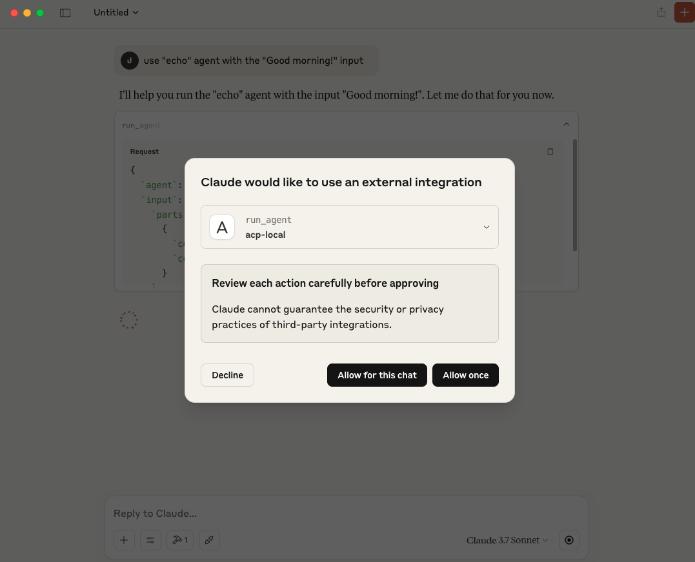
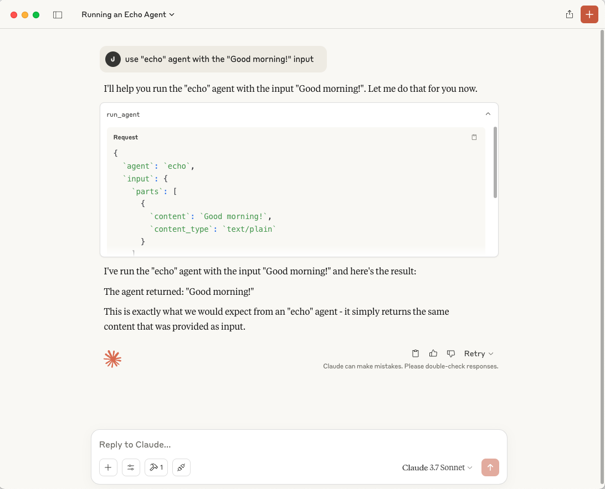

<div align="left">

<h1>ACP to MCP Adapter</h1>

**Connect ACP Agents to MCP Applications Seamlessly**

[](https://github.com/i-am-bee/beeai-framework?tab=Apache-2.0-1-ov-file#readme)
[](https://bsky.app/profile/beeaiagents.bsky.social)
[](https://discord.com/invite/NradeA6ZNF)
[](https://lfaidata.foundation/projects/)

</div>

The **ACP to MCP Adapter** is a lightweight standalone server that acts as a bridge between two AI ecosystems. The **Agent Communication Protocol (ACP)** supports agent-to-agent communication and collaboration, while the **Model Context Protocol (MCP)** connects AI models to external data sources, tools, and applications.

This adapter lets MCP-based applications, like **Claude Desktop**, discover and interact with ACP agents, without needing to implement ACP directly. It works by connecting to your ACP server, discovering available agents, registering them as MCP resources, and exposing a tool to run them.

## Capabilities

- Makes ACP agents discoverable as MCP resources
- Exposes ACP agent runs as MCP tools
- Bridges two agent ecosystems with minimal configuration

## Requirements

- Python 3.11 or higher
- Installed Python packages: `acp-sdk`, `mcp`
- An ACP server running _(Tip: Follow the [ACP quickstart](https://github.com/i-am-bee/acp/blob/main/README.md#quickstart) to start one easily)_
- An MCP client application - for the quickstart we will be using [Claude Desktop](https://claude.ai/download)

## Quickstart

**1. Install the Adapter**

Install using uvx:

```sh
uvx install acp-mcp
```

**2. Run the Adapter**

Start the adapter and connect it to your ACP server:

```sh
uvx acp-mcp http://localhost:8000
```

> [!NOTE]
> Replace `http://localhost:8000` with your actual ACP server URL if different in steps 2 & 3.

**3. Connect via Claude Desktop**

To connect via Claude Desktop, follow these steps:
1. Open the Claude menu on your computer and navigate to Settings (note: this is separate from the Claude account settings).
2. In the Settings pane, click on Developer and then select Edit Config.
3. This will create a configuration file at the following locations:
  - macOS: `~/Library/Application Support/Claude/claude_desktop_config.json`
  - Windows: `%APPDATA%\Claude\claude_desktop_config.json`<br />
If the file doesn't already exist, it will be created for you and displayed in your file system.
4. Open the configuration file in a text editor and replace its contents with the following:

```json
{
  "mcpServers": {
    "acp-local": {
      "command": "uvx",
      "args": ["acp-mcp", "http://localhost:8000"]
    }
  }
}
```

**4. Restart Claude Desktop and Invoke Your ACP Agent**

After restarting Claude Desktop, you can invoke your ACP agent. For example, use the "echo" agent with the following input:

```
use "echo" agent with the "Good morning!" input
```

Accept the external integration:



Observe the execution of your agent:



## How It Works

1. The adapter connects to your ACP server.
2. It automatically discovers all registered ACP agents.
3. Each ACP agent is registered in MCP as a resource using the URI: `acp://agents/{agent_name}`
4. The adapter provides a new MCP tool called `run_agent`, letting MCP apps easily invoke ACP agents.

## Supported Transports

- Currently supports Stdio transport

---

Developed by contributors to the BeeAI project, this initiative is part of the [Linux Foundation AI & Data program](https://lfaidata.foundation/projects/). Its development follows open, collaborative, and community-driven practices.
